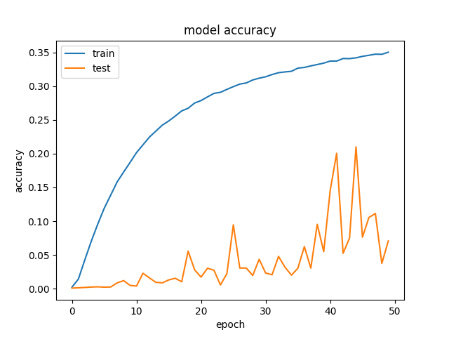
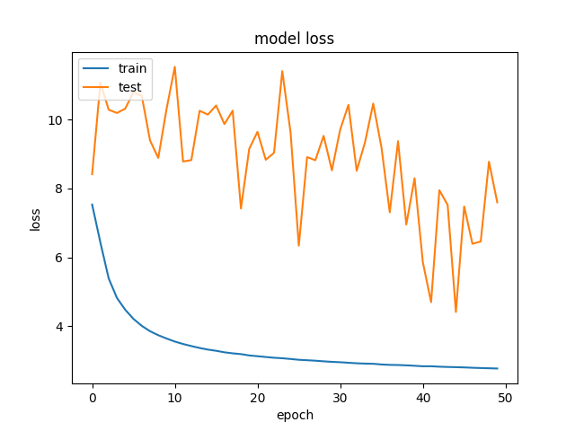

# Hangeul_classification

https://www.eiric.or.kr/special/special.php

EIRIC(전자정보연구정보센터)의 문자DB를 이용하여 한글 필기체를 딥러닝으로 classification한 내용입니다.

## Training

### hanguel_classification.py를 set 05 폴더에 넣고 실행시킨다.

## TODO

* 어떤 글자가 주로 틀리는지 확인하기

* 다른 데이터셋에서도 확인 하기