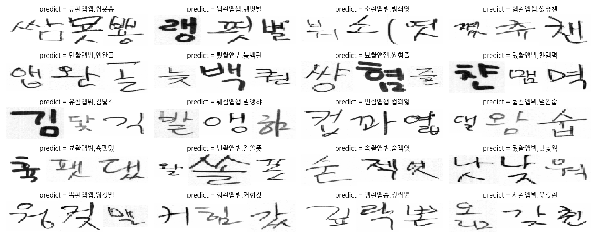

# Hangeul_classification

https://www.eiric.or.kr/special/special.php

EIRIC(전자정보연구정보센터)의 문자DB를 이용하여 한글 필기체를 딥러닝으로 classification한 내용입니다.

CRNN 구조는 https://github.com/qjadud1994/CRNN-Keras 의 코드를 수정하여 사용했습니다.

CRNN 학습과정은 이곳(https://soyoung-new-challenge.tistory.com/category/DeepLearning/OCR_)을 참고하였습니다

focal_ctc loss와 글자를 SSD를 이용하여 찾는 코드입니다.(https://github.com/PrimadonnaGit/tpgr_ssd_detectors)

## Data info
num_class = 2350

class의 이름은 유니코드로 작성되어 있음

## DATA generation
기존 데이터에서 글자만 crop한 후 랜덤하게 3개의 글자를 뽑아서 서로 붙여준다.

## CRNN 결과

## File Description

|       File         |Description                                       |
|--------------------|--------------------------------------------------|
|hanguel_classification.py   |글자 classification                        |
|image_crop.py       |기존 이미지데이터에서 글자만 crop해옴                    |
|Image_Generator. py |Image batch generator for training                |
|parameter. py       |Parameters used in CRNN                           |
|training. py        |CRNN training                                     |
|Prediction. py      |CRNN prediction                                   |
|npy files      |저장된 data 정보들                       |
